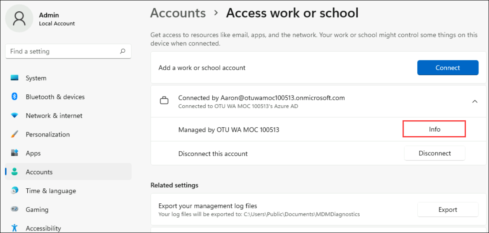
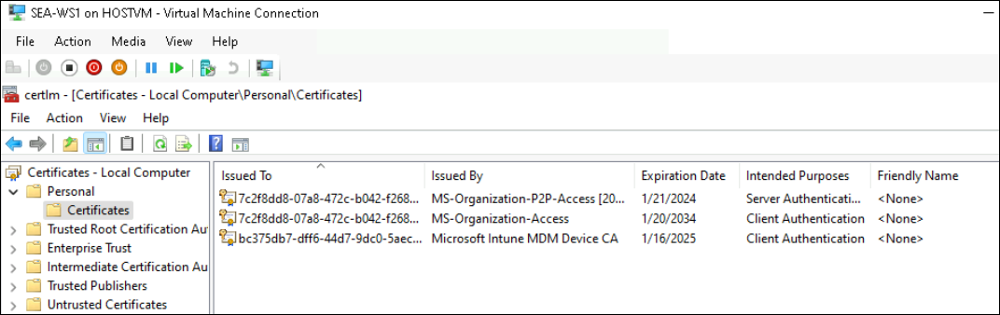
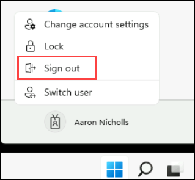
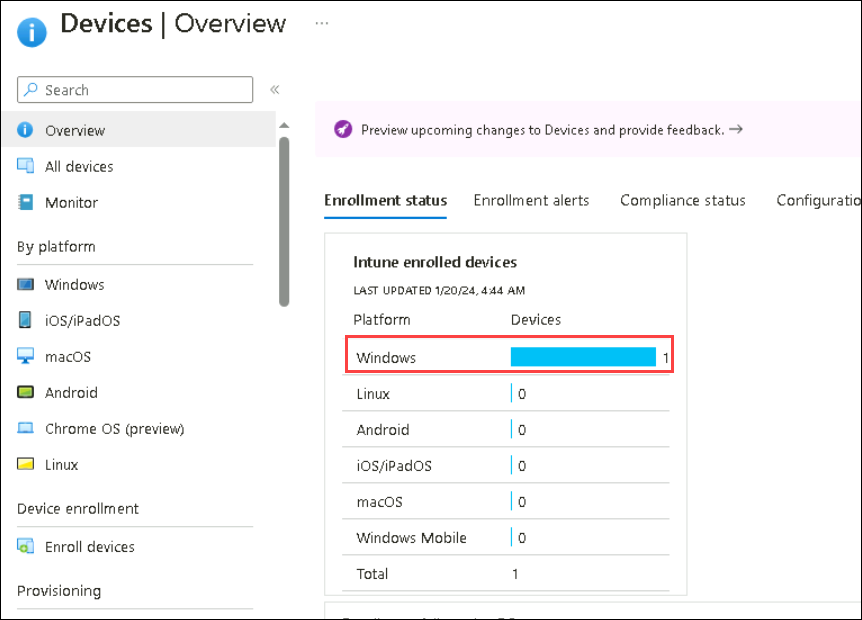

# Practice Lab: Enrolling devices into Microsoft Intune

## Summary

In this lab, you will join a Windows client to Entra ID and verify that the device has automatically enrolled into Microsoft Intune.

### Prerequisites

To following lab(s) must be completed before this lab:

- 0101-Managing Identities in Entra ID

- 0102-Synchronizing Identities by using Microsoft Entra Connect

- 0203-Manage Device Enrollment into Intune

  > Note: You will also need a mobile phone that can receive text messages used to secure Windows Hello sign-in authentication to Azure AD.

### Scenario

You have assigned Aaron Nicholls appropriate licenses and will now test the process of joining a Windows device to Azure AD and have it automatically enroll in Microsoft Intune.

### Task 1: Automatically enroll a Windows device to Microsoft Intune

1. Switch to **HOSTVM** and Sign in to **SEA-WS1** VM from the desktop shortcut as **Admin** with the password of **Pa55w.rd**.

2. Select **Start** and then select **Settings**.

3. In **Settings**, select **Accounts**.

4. On the Accounts page, select **Access work or school**.

5. In the **Access work or school** page, select **Connect**.

6. In the **Microsoft account** window, select **Join this device to Microsoft Entra ID**.

7. On the **Sign in** page, type **`Aaron@yourtenant.onmicrosoft.com`** and then select **Next**.

8. On the **Enter password** page, enter **Pa55w.rd** and then select **Sign in**.

9. On the **Make sure this is your organization** dialog box, select **Join**.

10. On the **You're all set!** page, read the information and then select **Done**.

11. In the **Access work or school** section, verify that **Connected to Contoso's Azure AD** displays.

12. Select **Connected to Contoso's Azure AD** and then select **Info**.

    

13. Take note of the information regarding the areas managed by Contoso, scroll down, and then select **Sync**. This will force a Device sync with Intune.

14. Close the **Settings** window.

### Task 2: Validate device enrollment into Entra And Intune

1. On the **SEA-WS1** taskbar, select **Start**, type **cert**, and select **Manage computer certificates**. Click on **Yes** in the following pop-up dialog box.
    
2. In the **Certificates** console, in the navigation pane, expand **Personal** and select the **Certificate** node. Verify that the following certificates are listed in the details pane:

-   Microsoft Intune MDM Device CA
-   MS-Organization-Access
-   MS-Organization-P2P-Access \[2023\]

    This indicates that the device is enrolled in Entra and Intune.

    

    >**Note**: Wait for 5-10 mins to get certificates.

3. Close the Certificates window.

4. Right-click **Start**, and then select **Windows Terminal (Admin)**. When prompted select **Yes**.

5. In the PowerShell console, type the following and press **Enter**: 

    ```
    dsregcmd /status
    ```

6. In the output under **Device State**, verify that **AzureAdJoined : YES** is displayed. This indicates that the device is Entra joined.

7. In the output under **Tenant Details**, verify that the following three entries exist:

    ```
    mdmUrl:https://enrollment.manage.microsoft.com/enrollmentserver/discovery.svc
    mdmTouUrl:https://portal.manage.microsoft.com/TermsofUse.aspx
    mdmComplianceUrl:https://portal.manage.microsoft.com/?portalAction=Compliance
    ```

> Note: These entries indicate that the device is enrolled in Intune.

### Task 3: Sign in as an Entra user

1. Sign out of **SEA-WS1**. (Close the VM once signed out)

   >**Note** : Before proceeding with the next step, ensure that you are in basic session mode and able to view Clipboard in the menu bar as shown in the below image. If not please change it to the basic session by selecting the icon which was highlighted in the tool bar in the below image.

   

2. Open the VM **SEA-WS1** in log in screen Select **Other user**, and sign in as **`Aaron@yourtenant.onmicrosoft.com`** with the password **Pa55w.rd**. Wait for the profile to be created.

 - At the **Use Windows Hello with your account** page, select **OK**.
 
 - On the **More information required** page, select **Next**.

 - On the **Keep your account secure** page, select **I want to set up a different method**.

 - In the **Choose a different method** dialog box, select **Phone** and then select **Confirm**.

 - On the **Phone** page, in the **Enter phone number** field, enter your mobile phone number which is able to receive text messages. Select **Next**.

 - When you receive the verification code, enter the code on the Phone page and then select **Next**.

 - On the verification page, select **Next** and then select **Done**.

 - On the **Set up a PIN** page, in the **New PIN** and **Confirm PIN** boxes, type **102938** and then select **OK**.

 - On the **All set!** page, select **OK**.

 - Sign out of **SEA-WS1**.

   

### Task 4: Verifying device enrollment in the Intune console

1. Switch to **SEA-SVR1** as **Contoso\Administrator** with the password of **Pa55w.rd**. 

2. In Microsoft Edge, type **https://intune.microsoft.com** in the address bar, and then press **Enter**. Sign in with your Tenant administrator account.

3. In the navigation pane, select **Devices**.

4. On the **Devices | Overview** blade under **Intune enrolled devices**, verify that **1** is displayed next to **Windows**. It may take a while to display.

    

5. On the **Devices** blade, select **All devices** and verify that **SEA-WS1** is listed.

6. Note that for SEA-WS1, the **Managed by** column displays **Intune** and the **Ownership** column displays **Corporate**. 

   _Note: This view lists devices that are joined to Azure AD. Remember that you configured automatic enrollment between Azure AD and Intune, and because of that, any device that is joined to Azure AD is automatically enrolled in Intune. Any devices joined prior to setting up enrollment are only joined to Azure AD, but not enrolled in Intune._

7. Open a new tab in **Microsoft Edge**, in the address bar type **https://entra.microsoft.com**, and then press **Enter**.

8. In the Microsoft Entra admin center, expand **Identity**.

9. Select **Devices**, then select **All devices**. 

   > Take note of SEA-WS1. Notice that the Join Type column displays **Microsoft Entra joined** and the MDM column displays **Microsoft Intune**.

10. Close all open Windows.

**Results**: After completing this exercise, you will have successfully joined a Windows client to Entra and verified that the device has automatically enrolled into Microsoft Intune.

**END OF LAB**
