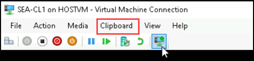

# Practice Lab: Configuring Self-service password reset for user accounts in Azure AD

## Summary

In this lab, you will configure and validate self-service password reset (SSPR) for user accounts in Azure Active Directory.

### Prerequisites

To following lab(s) must be completed before this lab:

- 0102-Synchronizing Identities by using Azure AD Connect
- 0203-Manage Device Enrollment into Intune


### Scenario

The Help Desk has indicated that a large number of support tickets are related to password resets. You have been asked to propose a solution for users to reset their own password. For accounts that are synchronized from AD DS, the process should reset both their Azure AD and AD DS password. 

### Task 1: Configure password writeback

1. Sign in to **SEA-SVR1** as **Contoso\\Administrator** with the password **Pa55w.rd** and close **Server Manager**.

2. On the desktop, double-click **Azure AD Connect**.

3. On the **Welcome to Azure AD Connect** page, select **Configure**.

4. On the **Additional tasks** page, select **Customize synchronization options**, and then select **Next**.

5. On the **Connect to Azure AD** page, if needed type **<inject key="AzureAdUserEmail"></inject>** in the **USERNAME** text box, type your Admin tenant password **<inject key="AzureAdUserPassword"></inject>** in the **PASSWORD** text box, and then select **Next**.

6. On the **Connect to your directories** page, select **Next**.

7. On the **Domain and OU filtering** page, select **Next**.

8. On the **Optional features** page, select **Password writeback**, and then select **Next**.

9. On the **Ready to configure** page, select **Configure**.

10. On the **Configuration complete** page, select **Exit**.

11. On **SEA-SVR1**, on the taskbar select **Microsoft Edge**, in the address bar type **https://portal.azure.com/**, and then press **Enter**.

12. Search and select **Azure Active Directory** from the portal.

13. On the left, select **Azure AD Connect**.
   
14. On the left, select **Cloud sync**.

15. On the left, select **Agent**.

16. Select **Download on-premises agent**, and select Accept terms & download.

17. Once the Azure AD Connect Provisioning Agent Package has completed downloading, run the **AADConnectProvisioningAgentSetup.exe** installation file from your downloads folder.

18. On the splash screen, select **I agree to the license and conditions**, and then select **Install**.

19. Once the installation operation completes, the configuration wizard will launch. Select Next to start the configuration.

20. On the Select Extension screen, select **HR-driven provisioning (Workday and SuccessFactors) / Azure AD Connect Cloud Sync** and click **Next**.

21. On the **Connect to Azure AD** page, if needed type **<inject key="AzureAdUserEmail"></inject>** in the **USERNAME** text box, type your Admin tenant password **<inject key="AzureAdUserPassword"></inject>** in the **PASSWORD** text box, to provide authentication.

22. On the **Configure Service Account** screen, select **Create gMSA** and enter **Contoso.com\Administrator** under DOMAIN ADMIN USERNAME and **Pa55w.rd** under Password text box and click on **Next**.

23. On the **Connect Active Directory** screen, leave the default configuration and click on **Next**.

24. On the **Configuration complete** screen, select Confirm. This operation will register and restart the agent.

25. Once this operation completes, you should be notified that **Your agent configuration was successfully verified**. You can select **Exit**.

### Task 2: Enable self-service password reset

1. On **SEA-SVR1**, on the taskbar select **Microsoft Edge**, in the address bar type **https://entra.microsoft.com/**, and then press **Enter**.

2. Sign in as  **<inject key="AzureAdUserEmail"></inject>**, and use the tenant Admin password **<inject key="AzureAdUserPassword"></inject>**, If the **Stay signed in?** prompt appears, select **No**.  

   > The Microsoft Entra admin center opens.

3. In the Microsoft Entra admin center, Navigate to the Search resources section of the site.

4. In the search box, type **password reset**, and then select **Password reset**.

5. In the **Password reset | Properties** window, select **All** to enable self-service password reset to all users. Select **Save**.

6. On the **Password reset | Properties** blade, select **Authentication methods**.

7. For the methods available to users, ensure that **Mobile Phone** and **Email** are selected, and then select **Security Questions**.

8. For the **Number of questions required to register**, select **3**.

9. For the **Number of questions required to reset**, select **3**.

10. In the **Select security questions** section, select **No security questions configured**, then select **Predefined**. Select three questions of your choice, and then select **Ok**.

11. Select **Save**.

12. Select **Registration** Select **No** for **Require users to register when signing in**, and the select **Save**.

13. In the navigation pane, select **On-premises integration**.

14. Verify that your on-premises writeback client is running and Select the checkbox for **Write back passwords with Azure AD Connect cloud sync** and then click **Save**.

15. Close Microsoft Edge.

### Task 3: Validate self-service password reset

1. Switch to **SEA-WS3**.

2. If necessary, sign in as **Admin** with the password of **Pa55w.rd**.

3. On the taskbar, select **Microsoft Edge**.

4. Browse to **https://myaccount.microsoft.com**. 

5. On the **Pick an account** page, select **Use another account**.

6. On the **Sign in** page, enter **`Aaron@yourtenant.onmicrosoft.com`** and then select **Next**.

7. On the **Enter password** page, enter **Pa55w.rd** and then select **Sign in**. If the Microsoft Edge prompts to save the password, select **Save**.

8. On the **My Account** page, in the navigation pane, select **Password**.

9. On the **Change password** page, enter the following information and then select **submit**:
     - Old password: **Pa55w.rd**
     - Create new password: **Pa55w.rd1234!**
     - Confirm new password: **Pa55w.rd1234!**

10. If Microsoft Edge prompts to save the password, select **Save**.

11. Close Microsoft Edge and sign out of SEA-WS3.

### Task 4: Run AD Sync

*Note that this step is normally not necessary for password writeback, but is recommended to address issues inherent in lab environments and ensure AD DS is synchronized with Azure AD.*

1. Switch to **SEA-SVR1**.

2. Right-click **Start** and then select **Windows PowerShell (Admin)**.

3. At the **Windows PowerShell** command prompt, type the following command, and
    then press **Enter**:

    ```
    Start-ADSyncSyncCycle –PolicyType Delta
    ```

4. Close Windows PowerShell, and then wait for approximately 3-4 minutes.

### Task 5: Verify password writeback

1. Switch to **SEA-CL1** and sign out if necessary.

   >**Note** : If you are unable to switch to SEA-CL1, then turnoff the Hyper-V VM's which are not being used in this lab from the HyperV-Manager and then try to switch to SEA-CL1.

   >**Note** : Before proceeding with the next step, ensure that you are in basic session mode and able to view Clipboard in the menu bar as shown in the below image. If not please change it to the basic session by selecting the icon which was highlighted in the tool bar in the below image.

   
2. On **SEA-CL1**, select **Other user**, and then attempt to sign in as **Contoso\\Aaron** with the password of **Pa55w.rd**.

3. Ensure that you get the message that the user name or password is incorrect.

4. Sign in to **SEA-CL1** as **Contoso\\Aaron** with the password **Pa55w.rd1234!**. 

   > You should be able to sign in. This confirms that the password you changed in the Azure portal is written back to the local Active Directory Domain Services (AD DS) account.

5. Sign out of **SEA-CL1**.

**Results**: After completing this exercise, you will have successfully configured and validated self-service password reset.

**END OF LAB**
