# Practice Lab: Deploying Windows with Autopilot

## Summary

In this lab you will learn how provision a Windows 11 device with Autopilot using User-driven mode.

### Prerequisites

To following lab(s) must be completed before this lab:

- 0101-Managing Identities in Azure AD

- 0102-Synchronizing Identities by using Azure AD Connect

- 0701-Deploying Windows 11 using Microsoft Deployment Toolkit


### Scenario

Contoso IT is planning to roll out a deployment of new Windows 11 devices using Autopilot. The devices have a default installation of Windows 11. Users should be able to connect the device, turn it on, and answer minimal questions during the OOBE, using their Azure AD credentials to sign in. The process should automatically enroll and join the Azure AD domain. You have been asked to configure and test the experience using the SEA-WS4, which you recently installed and configured using Hyper-V.

> **Important**: We cannot use Windows 11 Hyper-V based virtual machines for Autopilot testing (Which we configured in the previous lab, 0701). This is due to a physical Trusted Platform Module (TPM) requirement. In this lab, we will test autopilot using Windows 10, however in the real world you can follow the same process for deploying windows 11 via Autopilot. for more details, see [Troubleshooting Windows Enrollment Issues](https://learn.microsoft.com/en-us/troubleshoot/mem/intune/device-enrollment/troubleshoot-windows-enrollment-errors#securing-your-hardware-failed-0x800705b4).

### Task 1: Create group in Azure AD

1. Sign in to **SEA-SVR1** as **Contoso\\Administrator** with the password **Pa55w.rd** and close **Server Manager**.

2. On the taskbar, select **Microsoft Edge**.

3. In Microsoft Edge, in the address bar, type **https://entra.microsoft.com**, and then press **Enter**. If prompted, sign in with your **<inject key="AzureAdUserEmail"></inject>**, and use the tenant Admin password **<inject key="AzureAdUserPassword"></inject>**

4. In the navigation pane, Expand **Identity**.

5. Under **Groups**, select **All groups**.

6. In the **Groups | All groups** blade, select **New group**.

7. In the **New Group** blade, in the **Group type** list, select **Security**.

8. In the **Group name** box, type **IT Devices**.

9. In the **Group description** box, type **IT Department Devices**.

10. In the **Membership type** list, select **Dynamic Device**.

11. Select **Add dynamic query**.

12. On the **Dynamic membership rules** blade select **Edit** above the **Rule syntax** box.

13. In the Edit rule syntax text box, add the following simple membership rule and select **OK**.

```
(device.devicePhysicalIDs -any (_ -contains "[ZTDId]"))
```
14. Select **Save** to close **Dynamic membership rules**, and then select **Create** to create the group.

### Task 2: Create a virtual machine using Hyper-V

1. On the JumpVM/LabVM, Click on Hyper-V manager available on the Task bar

1. In Actions click on New and Click on Virtual machine.

   

1. In the New virtual machine wizard. Click on Next for before you begin.

   

1. In Specify Name and location enter the name **SEA-W10-CL3** and click on next.

   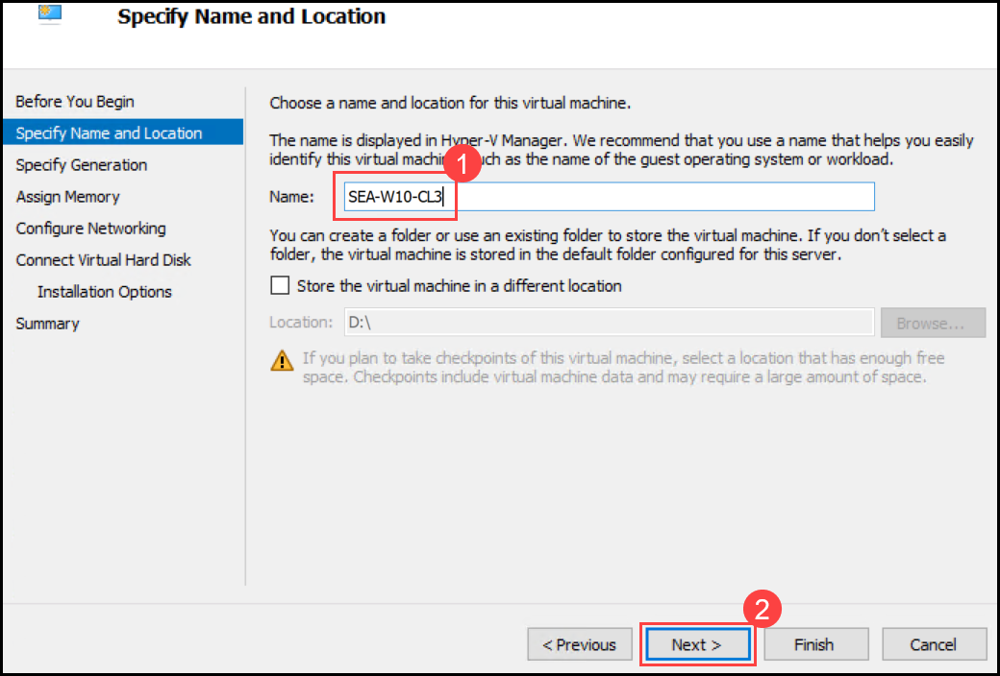

1. In Specify Generation click on **gen 1** and click on next.

   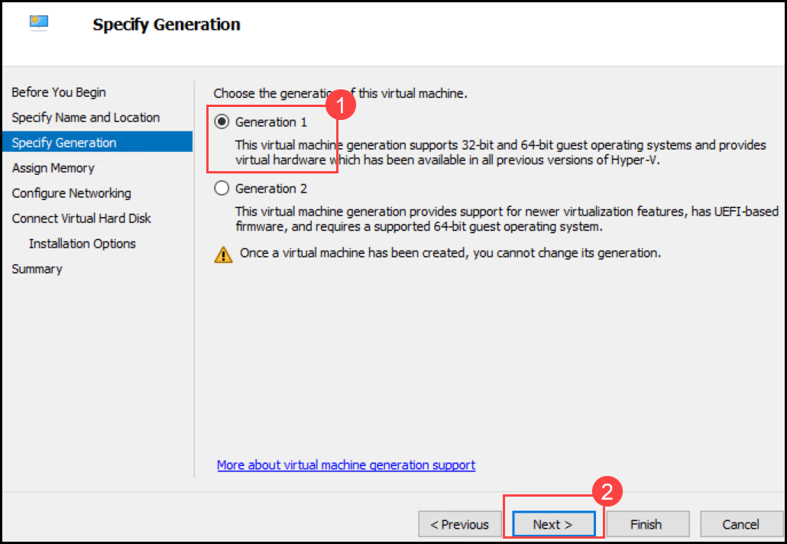

1. In Assign Memory enter the size **4096** and enable **use dynamic memory for this virtual machine** and click on Next

   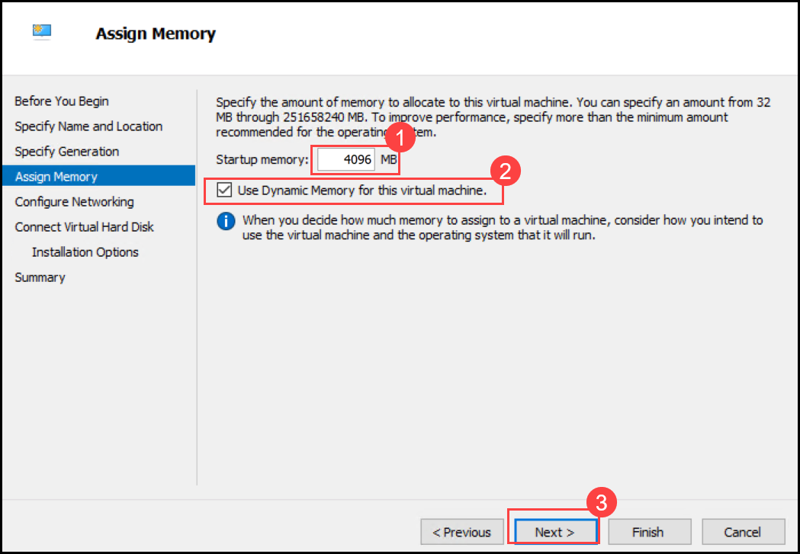

1. In Configure networking Select the drop down and choose **internal switch** and click on Next

   

1. In Connect Virtual Hard disks Leave the default settings and click on next.

1. In installation options select Install operating system from bootable CD/DVD ROM. Under that select **Image file iso**

1. Click on browse and navigate to **D:\Labfiles\ISOs** and select **Win10.iso** and click on next summary

   

1. Review the settings and click on finish.

## Task 03: Configure Domain for the created virtual machine

1. Once the virtual machine is created Right click on the virtual machine and click on start.

1. Once the VM is in the Running state Right click on it and click on Connect.

   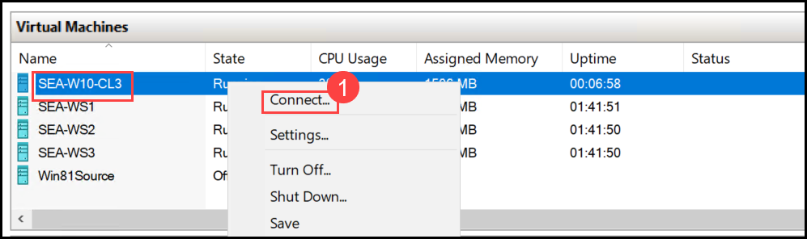

1. You can see the Windows setup wizard.

1. Select the default language i.e English(united states) and click on next

1. Click on Install

   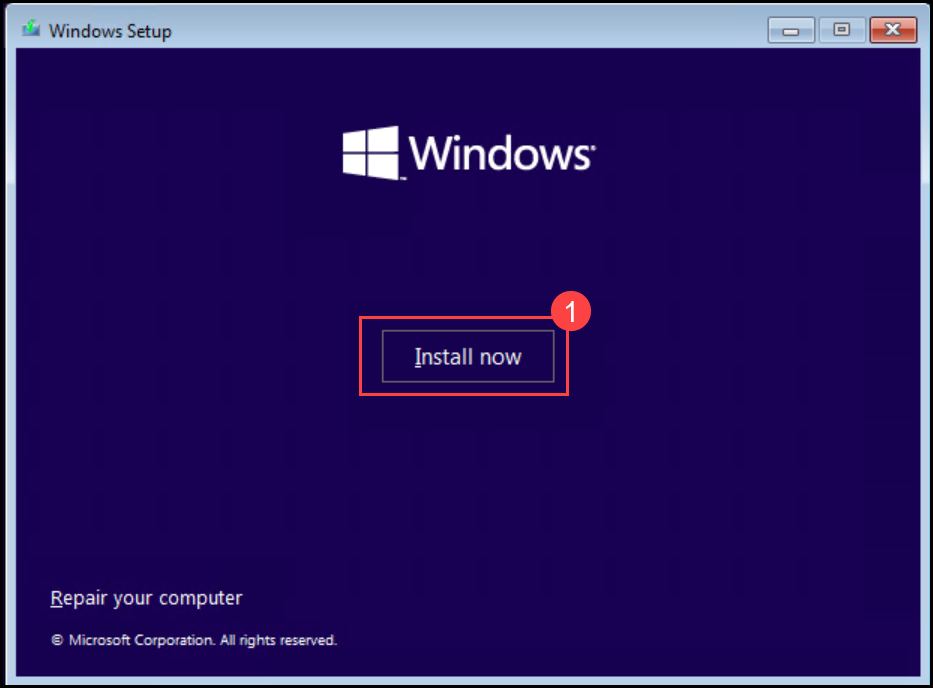

1. Click on **I Accept** License terms. and click on next

   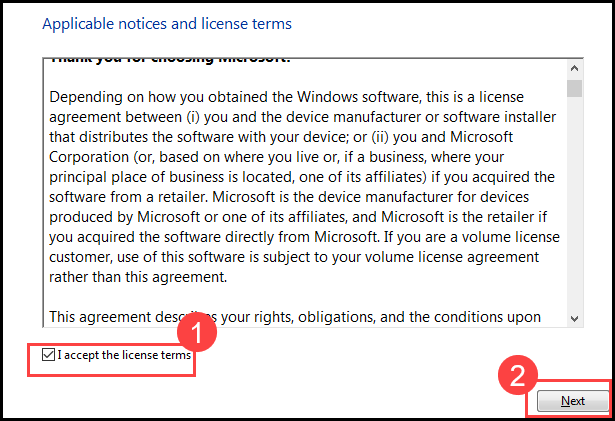

1. In the Installation type choose **Custom installation(advanced)**

1. Select the storage and click on next. and the installation will begin.

   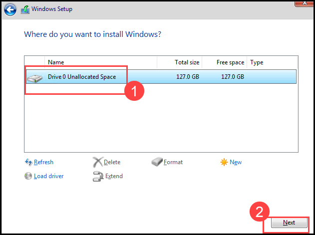

   >**Note**: Installation might roughly take upto 15-20 mins.

1. Once the installation is completed it will ask you to select Region. Select The default one (United States)

1. Select the Keyboard layout **US**

   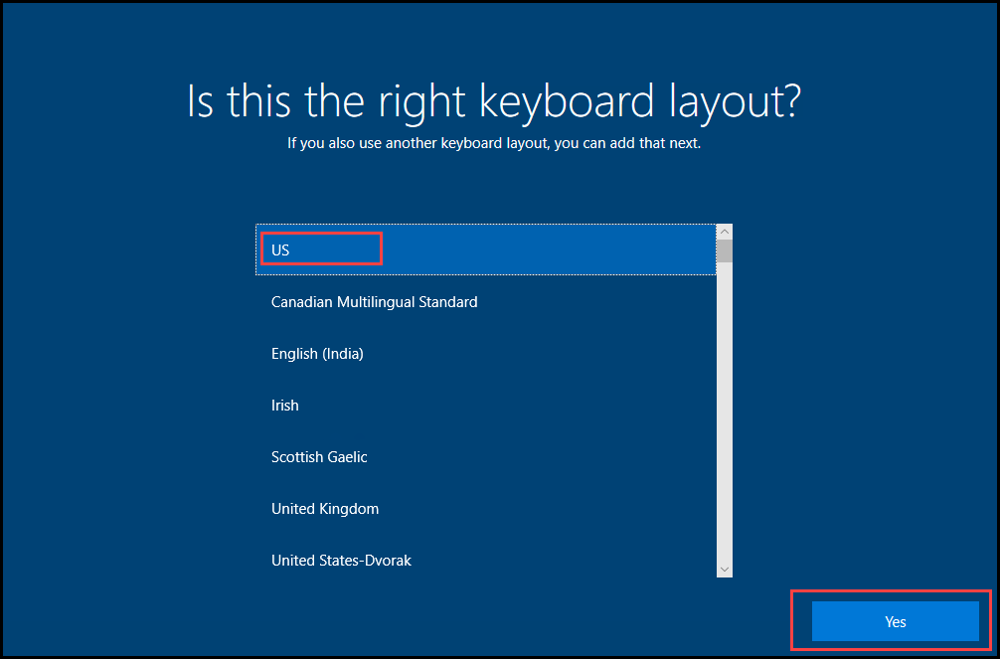

1. Skip Additional keyboard layout.

   

1. When the Wizard asks you to sign in with microsoft. Select **Domain join instead** from the bottom left.

   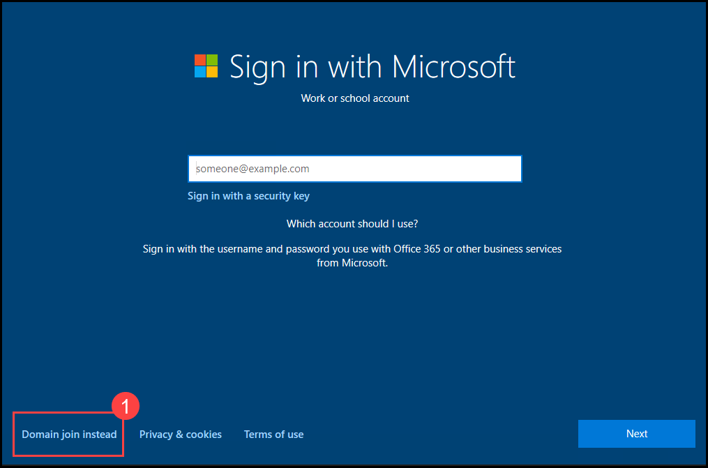

1. Give the username **Admin** and click on next.

1. For password and Confirm password, enter **Pa55w.rd** and Select Next.

1. On create security questions for this account page, Select any three question of your choice and fill in the answers Then click on next.

1. Click on Accept for Choose privacy settings for your device page.

   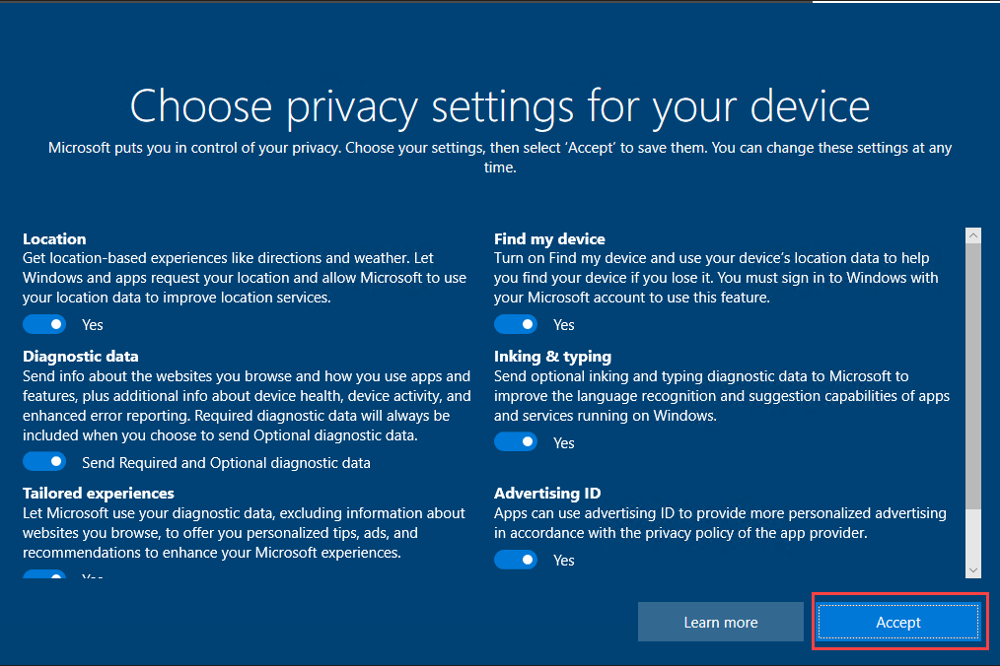

1. Click on Not now for the Cortana setup.

   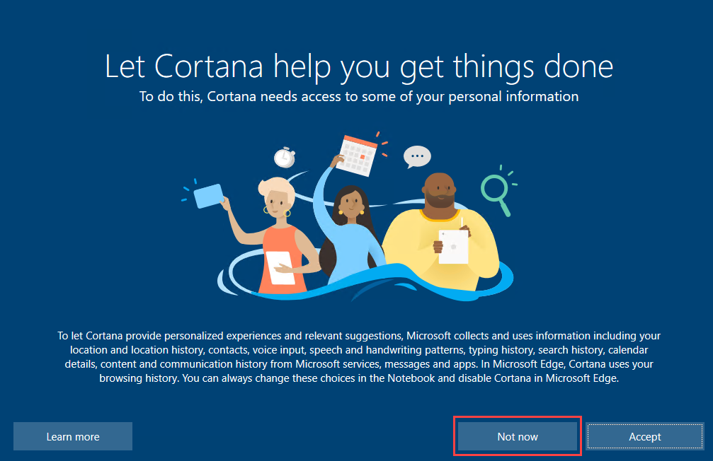

1. The setup will take few minutes to complete.

1. Once completed, the Connect screen pops up from hyper-v click on connect. The system reboots

   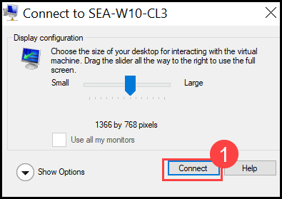

1. Once Rebooted it asks for username and password. Enter **Admin** for username and **Pa55w.rd** for password.

1. Once you are logged in Press **win key + R** or search **Run** in Start to open Run command.

1. Type **sysdm.cpl** and press enter. It opens System properties.

1. Click on **Change**.

   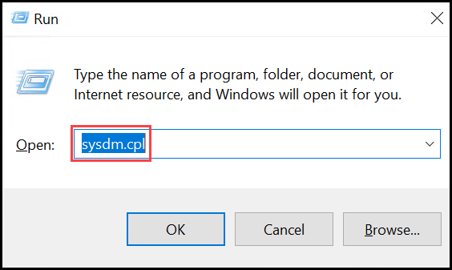

   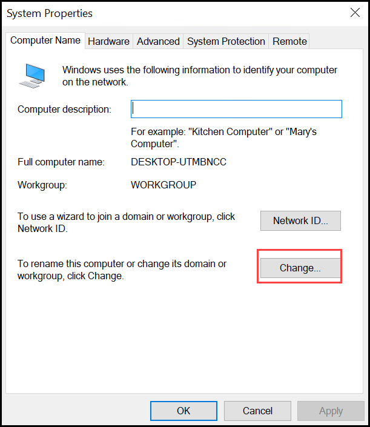

1. When the screen pops-up leave the computer name as default, and under **member of** select Domain and Type **Contoso.com**, Select Ok

1. Windows security screen pops-up Give username as **Administrator** And Password as **Pa55w.rd**. Press enter

   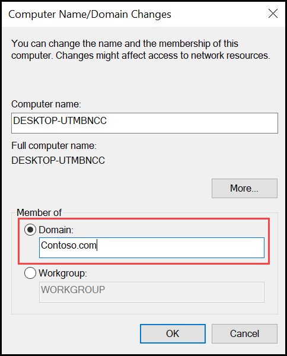

   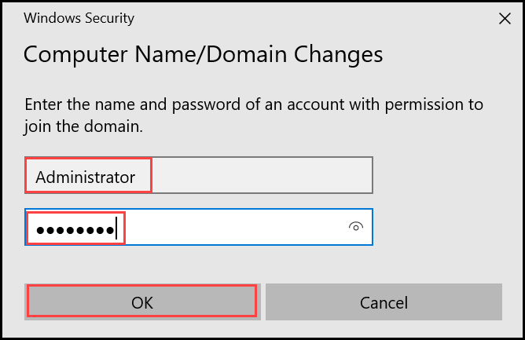

1. A screen pops-up with Restart request. Select Restart now.

   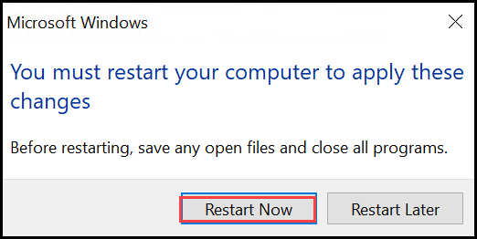

### Task 4: Generate a device-specific comma-separated value (CSV) file

1. In the **SEA-W10-CL3** VM, sign in with **Admin** enter **Pa55w.rd** for password.

2. Right-click **Start**, select **Windows PowerShell (Admin)**, and then select **Yes** at the **User Account Control** prompt.

3. At the Windows PowerShell command-line prompt, type the following cmdlet, and then press **Enter**:

    ```
    Install-Script -Name Get-WindowsAutoPilotInfo
    ```

4. You will receive three prompts. Each time, type **Y**, and then press **Enter**.

5. At the Windows PowerShell command-line prompt, type the following cmdlet, and then press **Enter**:

    ```
    Set-ExecutionPolicy RemoteSigned
    ```

6. When prompted, type **Y**, and then press Enter.

7. At the Windows PowerShell command-line prompt, type the following cmdlet, and then press **Enter**:

    ```
    Get-WindowsAutoPilotInfo.ps1 -OutputFile C:\Computer.csv
    ```

8. At the Windows PowerShell command-line prompt, type the following command, press **Enter**, and then review the file content:

    ```
    type C:\Computer.csv
    ```

9. Close out of **Windows Powershell**.

### Task 5: Work with a Windows Autopilot deployment profile

1. On **SEA-W10-CL3**, in the windows taskbar, select **Microsoft Edge**.

2. In **Microsoft Edge**, navigate to **https://intune.microsoft.com**. Sign in with your  **<inject key="AzureAdUserEmail"></inject>** account.

    >Note: If prompted to register for MFA. Follow the same procedures you used earlier in the course to add your phone number.

3. In the **Microsoft Intune admin center**, select **Devices**.

4. In the **Device enrollment** section, select **Enroll devices**. 

5. In the details pane scroll down to **Windows Autopilot Deployment Program**, and then select **Devices**.

6. In the **Windows Autopilot devices** blade on the menu bar, select **Import**, select the **folder icon** and then browse to **C:\\**, select **Computer.csv**, select **Open**, and then select **Import**. 

   _Note: The import process can take up to 15 minutes, but normally takes around 5 minutes._  

   _**Important**: After the process is complete, the device may not show automatically. If this is the case, select the **Refresh** button. If the device still does not appear, select the **Sync** button, wait a few minutes, and then select **Refresh**._

7. Select **X** to close the **Windows Autopilot devices** blade. 

8. On the Windows enrollment blade, in the details pane, select **Deployment Profiles**.

9. On the **Windows AutoPilot deployment profiles** blade, select **Create profile** and then select **Windows PC**.

10. In the **Basics** tab, in the **Name** text box, type **Contoso profile1**.

11. For **Convert all targeted devices to Autopilot** select **No**, and then select **Next**.

12. On the **Out-of-box experience (OOBE)** tab, ensure that the **Deployment mode** is set to **User-Driven**.

13. Ensure that **Join to Azure AD as** is set to **Azure AD Joined**.

14. Ensure that the following options are set:

    - Microsoft Software License Terms: **Hide**

    - Privacy Settings: **Hide**

    - Hide change account options: **Hide**

    - User account type: **Administrator**.

    - Allow pre-provisioned deployment: **No**

    - Language (Region): **Operating system default**

    - Automatically configure keyboard: **Yes**

    - Apply device name template: **No**

15. Select **Next**.

16. On the **Assignments** tab, under **Included groups** select **Add groups**.

17. Select the **IT Devices** group and click **Select**. Select **Next**.

18. On the **Review + create** blade, review the information and then select **Create**.

19. Close out of **Microsoft Edge**

### Task 6: Reset the PC

1. On **SEA-W10-CL3**, select **Start**, type **reset** and select **Reset this PC**.

2. In the **Reset this PC** section, select **Get started**.

3. Select **Remove everything**, and then select **Local reinstall**.

4. Select **Next** and then select **Reset**.

   >Note: Normally this task is not required for new deployment of physical devices. The device’s autopilot info is either provided by the manufacturer or can be obtained from the device prior to the OOBE. For the purposes of this lab, we must initiate a reset to simulate a new device OOBE.

   >Note: This process can take 30-60 minutes and will reboot several times during the process.

### Task 7: Verify Autopilot deployment

1. At the **Contoso Corp. Sign-in Page**, enter **`Aaron@yourtenant.onmicrosoft.com`** and select **Next**.

2. At the Password page, enter **Pa55w.rd1234!** and select **Sign in**.

3. At the **Use Windows Hello with your account**, select **OK**.

4. At the **Verify your identity** page, select the Text verification method.

5. At the **Enter code** page, enter the code that has been texted to your mobile device and then select **Verify**.

6. On the **Setup up a PIN** dialog box, in the **New PIN** and **Confirm PIN** fields, enter **102938**, and then select **OK**.

7. On the **All set!** page, select **OK**.

8. Select **Start** and select **Settings**. 


9. Select **Accounts**, and then select **Access work or school**. Verify the device is connected to Contoso's Azure AD.

10. Select **Connected to Contoso's Azure AD** and select **Info**.

11. On the **Managed by Contoso** page, scroll down and then select **Sync**.

12. On **SEA-W10-CL3**, close the **Settings** window.

13. Switch to **SEA-SVR1**.

14. In the Microsoft Entra admin center, select **Identity**, select **Devices** and then select **All devices**. 

    > Note that the new device displays with an icon that indicates an Autopilot device. Also note that the Join Type is **Azure AD joined** with Aaron Nicholls as the owner.

15. Select the Autopilot device and then select **Manage**. 

16. Again select the Autopilot device to review the management page. 

    > Notice that you can Retire, Wipe, Sync, and Restart the device.

17. Select the ellipse at the end of the menu bar and take notice of the additional management capabilities.

    > Additional capabilities include Fresh Start, Autopilot Reset, Quick scan, Full scan, as well as others.

18. Close Microsoft Edge.

**Results**: After completing this exercise, you will have provisioned a Windows device with Autopilot using User-driven mode.

**END OF LAB**
